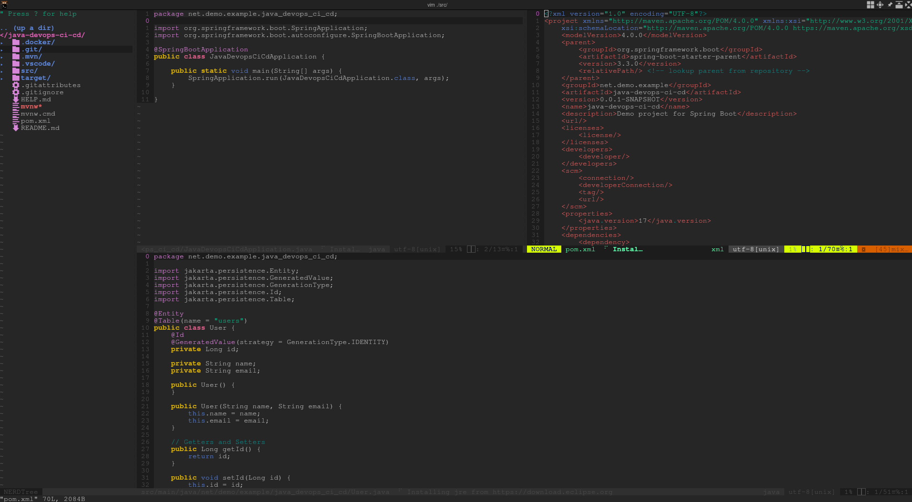

# How ton configure my vim editor in ArchLinux

- I configured this version a few years ago, so please review this version if you agree


## vim configure v1
### Files

- v1/vimrc
- v1/vimr-backup.nerdtree 

### Ignore file

- v1/vimr-backup.neerdtree

### Configuration

#### Note: I use archlinux, but it works on all other linux distributions.

```sh
mkdir ~/.vim
```
- Clone repository [vim-configuration](https://github.com/owenwilson/vim-configuration.git)
- Copy vimrc to ~/.vimrc

```sh
cp vimrc ~/.vimrc
```

```sh
mkdir -p ~/.vim/autoload && cd ~/.vim/autoload
```

```sh
curl -fLo ~/.vim/autoload/plug.vim --create-dirs https://raw.githubusercontent.com/junegunn/vim-plug/master/plug.vim
```

- Please execute vim in terminal
- Execute shift + : and add PlugInstall

```sh
:PluginInstall
```
### Reference

- [blog.jez.io](https://blog.jez.io/vim-as-an-ide/#plugin-delimitmate)
- [vimawesome.com](https://vimawesome.com/plugin/nerdtree-red)

## vim configure v2



- In this case, I have used new configurations for vim
- please use folder v2

```
mkdir -p ~/.vim/plugged 
```

- clone repository [vim-configuration](https://github.com/owenwilson/vim-configuration.git)


```
curl -fLo ~/.vim/autoload/plug.vim --create-dirs https://raw.githubusercontent.com/junegunn/vim-plug/master/plug.vim
```

- copy vimrc configuration


```
cp v2/vimrc ~/.vimrc
```

### Markdown plugin

- Please use the following configuration for markdown, edit vimrc

```
Plug 'plasticboy/vim-markdown'  " Markdown plugin
Plug 'iamcco/markdown-preview.nvim', { 'do': { -> mkdp#util#install() }, 'for': ['markdown', 'vim-plug']}
```

- add custom configuration

```
" configuration markdown
let g:mkdp_auto_start = 0           " Do not start automatically
let g:mkdp_auto_close = 1           " Close when exiting vim
let g:mkdp_refresh_slow = 0         " Instant update
let g:mkdp_browser = 'chromium'     " Use browser (o 'chrome', 'brave', 'chromium')
let g:mkdp_theme = 'dark'           " Themes ('light', 'dark')
```

- To see a real time-preview of the markdown, run this command in your vim editor, it will open a tab in your web browser and display the markdown file.

- Markdown start preview
```
MarkdownPreview
```

- Markdown stop preview
```
MarkdownPreviewStop
```

- Markdown alternate view
```
MarkfownPreviewToggle
```

## Review status plugin

- install plugin

```
PlugInstall
```

- status of plugin
```
:PlugStatus
```

- when you remove a plugin from the vimrc file, run the following a command to delete the folders for those plugins

```
:PlugClean
```

## Reference

- [setting-up-vim-as-a-alternative](https://mehmehsloth.medium.com/setting-up-vim-as-a-alternative-to-any-ide-for-development-fff3ceaa0359)
- [vim-plug#installation](https://github.com/junegunn/vim-plug#installation)

## Thanks!
