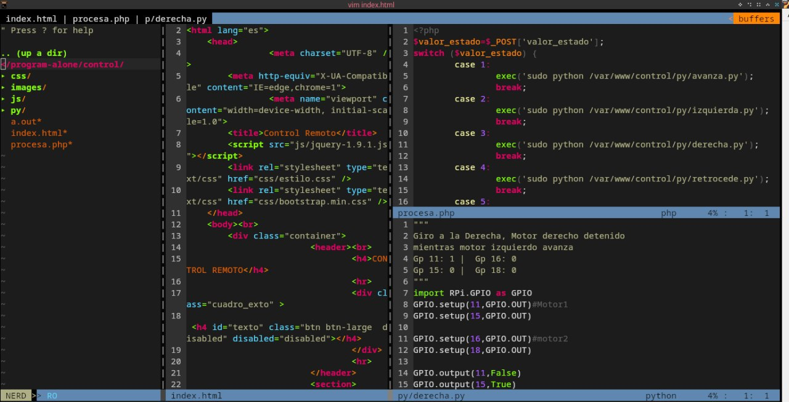

# How ton configure my vim editor in ArchLinux

- I configured this version a few years ago, so please review this version if you agree



## Files

- v1/vimrc
- v1/vimr-backup.nerdtree 

## Ignore file

- v1/vimr-backup.neerdtree

## Configuration

#### Note: I use archlinux, but it works on all other linux distributions.

```sh
mkdir ~/.vim
```
- Clone repository [vim-configuration](https://github.com/owenwilson/vim-configuration.git)
- Copy vimrc to ~/.vimrc

```sh
cp vimrc ~/.vimrc
```

```sh
mkdir -p ~/.vim/autoload && cd ~/.vim/autoload
```

```sh
curl -fLo ~/.vim/autoload/plug.vim --create-dirs https://raw.githubusercontent.com/junegunn/vim-plug/master/plug.vim
```

- Please execute vim in terminal
- Execute shift + : and add PlugInstall

```sh
:PluginInstall
```
## Reference

- [blog.jez.io](https://blog.jez.io/vim-as-an-ide/#plugin-delimitmate)
- [vimawesome.com](https://vimawesome.com/plugin/nerdtree-red)

## vim configure v2

- In this case, I have used new configurations for vim
- please use folder v2

```
mkdir -p ~/.vim/plugged 
```

- clone repository [vim-configuration](https://github.com/owenwilson/vim-configuration.git)


```
curl -fLo ~/.vim/autoload/plug.vim --create-dirs https://raw.githubusercontent.com/junegunn/vim-plug/master/plug.vim
```

- copy vimrc configuration


```
cp v2/vimrc ~/.vimrc
```

## 

## Reference

- [setting-up-vim-as-a-alternative](https://mehmehsloth.medium.com/setting-up-vim-as-a-alternative-to-any-ide-for-development-fff3ceaa0359)
- [vim-plug#installation](https://github.com/junegunn/vim-plug#installation)

## Thanks!
